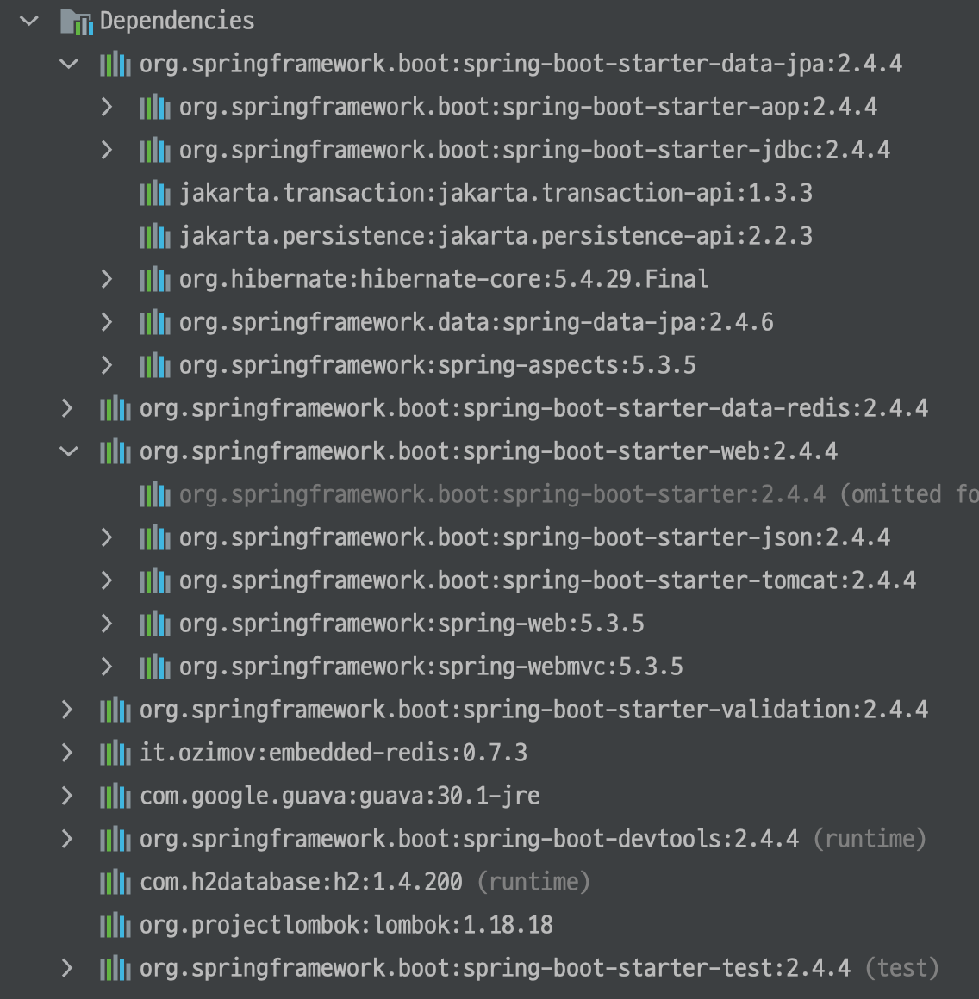
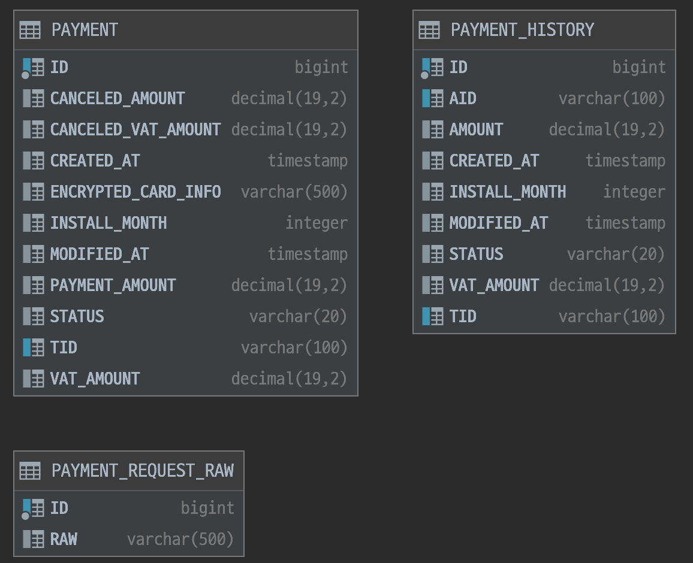
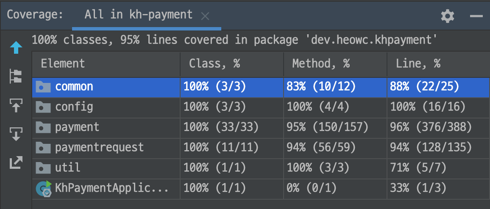

## 개발 프레임워크

- Spring Boot
- Spring Data Redis
- Spring Boot Web (내장 톰캣)
- Spring Boot Validation
- 내장 레디스
- Guava (유틸성 라이브러리)
- 인메모리 관계형 데이터베이스(H2)
- lombok
- Spring Boot Test



## 테이블 설계

- 결제 부모 테이블 : 결제 이력 테이블 = 1 : N
  - 직접적인 관계를 갖지 않도록 외래키 사용하지 않음
- 카드사 string 테이블


```sql
-- 결제 부모 테이블
create table payment (
    id bigint generated by default as identity, -- 시퀀스 번호
    tid varchar(20), -- 관라번호
    status varchar(20), -- 상태 (PAYMENT, PART_CANCEL_PAYMENT, CANCEL_PAYMENT)
    payment_amount decimal(19,2), -- 결제금액
    vat_amount decimal(19,2), -- 결제 부가가치세
    canceled_amount decimal(19,2), -- 취소한 결제금액
    canceled_vat_amount decimal(19,2), -- 취소한 부가가치세
    encrypted_card_info varchar(300), -- 암호회된 카드정보
    install_month integer, -- 할부
    created_at timestamp, -- 등록일자
    modified_at timestamp, -- 수정일자
    primary key (id)
);

-- 결제 이력 테이블
create table payment_history (
    id bigint generated by default as identity, -- 시퀀스 번호
    aid varchar(20), -- 관리번호
    tid varchar(20), -- 부모 관리번호
    status varchar(20), -- 구분 (PAYMENT, CANCEL)
    amount decimal(19,2), -- 결제금액
    vat_amount decimal(19,2), -- 부가가치세
    created_at timestamp,  -- 등록일자
    modified_at timestamp, -- 수정일자
    install_month integer, -- 할부
    primary key (id)
);

-- 카드사 string 테이븛
create table payment_request_raw (
    id bigint generated by default as identity, -- 시퀀스 번호
    raw varchar(500), -- 카드사 string raw 데이터
    primary key (id)
);

-- 결제 부모 테이블 tid에 유니크 인덱스 추가
alter table payment add constraint idx_payment_tid unique (tid);
-- 결제 이력 테이블 tid컬럼에 인덱스 추가
create index idx_payment_history_tid on payment_history (tid);
-- 결제 이력 테이블 aid에 유니크 인덱스 추가
alter table payment_history add constraint idx_payment_history_aid unique (aid);
```

## 문제해결 전략

### 0. 대략적인 구성

- PaymentController (/v1/payment/approve) <--> PaymentApprovedService (결제 승인 처리) <--> PaymentRequestService (카드사 요청)
- PaymentController (/v1/payment/cancel) <--> PaymentCancelService (결제 취소 처리) <--> PaymentRequestService (카드사 요청)
- PaymentController (/v1/payment) <--> PaymentSearchService (결제 조회 처리)


### 1. 카드결제 / 결제취소 / 결제정보 조회 

잘 정리되어 있는 레퍼런스를 참고하자. 
(https://developers.kakao.com/docs/latest/ko/kakaopay/common)

문서에서 통해 작성해야할 API는 단건 결제, 결제 취소, ~~주문 조회~~ 정도로 볼 수 있겠다.

### 2. 시스템 정책

#### 저장하는 string 데이터

- 서비스에서 로직으로 해결하지 말고 요청에 대한 응답과 도메인에서 사용할 클래스를 구분하여 올바른 string 데이터를 도출할 수 있도록 하자.
- 요청을 보내는 곳에서는 `PaymentRequestEntity` 클래스를 활용하고 그걸 분석하고 raw 데이터를 만드는 곳에서는 `PaymentRequestFrame`으로 처리

#### 부가가치세

고려해야할 점을 정리해보자
- optional에 대한 자동계산 처리 
  - `@Embeddable`, `@Embedded`를 활용하려 했으나, JPA에 아직 익숙하지 않아 `VatAmountUtil` 유틸클래스를 만들어서 활용
- 자동계산에 대한 정확한 계산(`BigDecimal`을 사용)
  - 결제금액과 부가가치세를 `BigDecimal`으로 처리
- 요청에 대한 검증 처리
  - 요청값으로만 처리할 수 있는 부분은 `hibernate-validator`를 활용하여 처리
  - 유효날짜의 경우는 `@ExpirationAt`를 만들어서 활용
  - 로직으로 처리해야 하는 부분은 실제 반영 전에 검증 처리

#### 카드정보 암/복호화

- 암복호화 처리에 양방향 암호화를 검색 후 선택하자.
  - 단순한 **Base64**를 활용
- 암호화, 복호화 처리를 로직으로 풀지말고 클래스를 분리하자.
  - 쉽게 다른 방식으로 변경할 수 있도록 `CipherService` 인터페이스를 만듬
  - `CipherService`는 인터페이스이기 때문에 테스트에도 쉽게 변형이 가능

#### 트랜잭션 데이터 관리

- 위에서 언급한 `tid`를 활용하여 각각의 요청을 묶자
- 마지막 상태에 대한 결제 데이터(payment 테이블), 매 요청마다에 대한 히스토리 테이블(payment_history 테이블)을 분리하자
- `tid`를 기준으로 분산 락을 통해 중복 요청을 막아보는 것은 어떨까?
  - 외부 redis를 사용하는 것은 환경상 불편하므로, 주로 테스트 용도로 사용있는 임베디드 레디스를 활용하자.

### 3. 필수 구현 API 기능명세

#### 결제 API

```text
POST /v1/payment/approve

{
  "card_number": "1234567890123456",
  "expiration_at": "0324"
  "cvc": "123",
  "install_month": 0, # 1~12
  "payment_amount": 1000,
  "vat_amount": 91 # optional
}

{
  "tid": "blabla~~~~~",
  "corp_response": "__________string_data___________" 
}
```

#### 결제 취소 API

```text
POST /v1/payment/cancel

{
  "tid": "blabla~~~~~",
  "cancel_amount",
  "cancel_vat_amount": 2 # optional
}

{
  "aid": "bla2bla2~~~~~",
  "corp_string_response": "__________string_data2___________" 
}
```

#### 데이터 조회 API

```text
GET /v1/payment/{tid}

{
  "tid": "bla2bla2~~~~~",
  "card_info": {
    "card_number": "1234567890123456",
    "expiration_at": "0324"
    "cvc": "123"
  },
  "status": "PAYMENT", # PART_CANCEL_PAYMENT, CANCEL_PAYMENT
  "amount": {
    "payment_amount": 1000,
    "vat_amount": 91,
    "canceled_amount": 0,
    "canceled_vat_amount": 0,
  }
  "approved_at": "2021-.....",
  "payment_action_details": [
     {
       "aid": "foooooo~~~~~"
       "type": "PAYMENT", # CANCEL
       "created_at": "2021-.....",
       "amount": 1000,
       "vat": 91
     }
  ]
}
```

### 4. 선택 문제

#### 부분 취소

다음 테스트 코드에서 확인 가능
- [KhPaymentApplicationScenarioTest.java](src/test/java/dev/heowc/khpayment/KhPaymentApplicationScenarioTest.java)

#### 멀티 쓰레드

다음 테스트 코드에서 확인 가능
- 통합 테스트가 아닌 레디스 단위 테스트
- set nx ex를 활용
- [RedisDistributionLockService.java](src/main/java/dev/heowc/khpayment/common/service/RedisDistributionLockService.java)
- [RedisDistributionLockServiceIT.java](src/test/java/dev/heowc/khpayment/common/service/RedisDistributionLockServiceIT.java)

### 5. 예외

- 스프링 부트에서 기본 셋팅으로 제공하는 형태로 에러 응답을 통일
- 예외 메시지는 `message`에 포함

```json
{
    "timestamp": "2021-03-20T04:15:32.881+00:00",
    "status": 400,
    "error": "Bad Request",
    "message": "취소 부가가치세가 남은 부가가치세보다 클 수 없습니다.",
    "path": "/v1/payment/cancel"
}
```

### 6. 그 외
므
- 테스트
  - 약 80 여개의 테스트 진행
  - CI 환경
    - GitHub Action 활용
    - [ci.yml](.github/workflows/ci.yml)
    - https://github.com/heowc/kh-payment/actions
  - 커버리지
    - 

## 빌드 & 실행

프로젝트를 clone 하여 해당 프로젝트에 접근 후, 아래 명령어 실행

```bash
./mvnw spring-boot:run
```